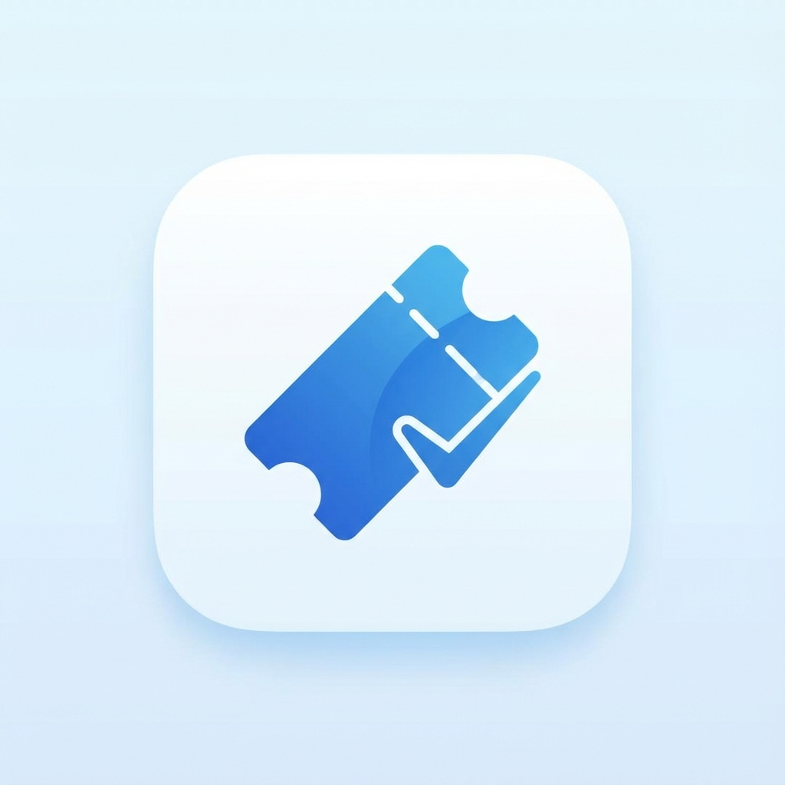

# Ticket Stash 🎫✨

**Ticket Stash** is a sleek, modern Flutter application designed to help travelers securely save and manage their transit tickets. Whether it's a PDF e-ticket or a photo of a physical pass, Ticket Stash keeps everything organized and accessible.



## 🚀 Features

- **Multi-Format Support**: Save both **PDFs** and **Images** (JPEG, PNG) directly to local storage.
- **Smart Search**: Quickly find tickets by Train Name or Station names using the persistent search bar.
- **Date Range Filter**: Filter your journeys by specific date ranges with a clean, themed UI.
- **Auto-Capitalization**: Smart input fields that ensure your station and train names look professional.
- **Modern Aesthetics**: A premium light blue theme with smooth gradients, floating snackbars, and Cupertino-style interactions.
- **Secure Local Storage**: Everything is saved locally on your device using SQLite—no internet required.
- **Quick View**: Open your tickets instantly in your device's default viewer.

## 🛠️ Technical Stack

- **Framework**: [Flutter](https://flutter.dev) (v3.27.0+)
- **State Management**: [Riverpod](https://riverpod.dev) - Used for reactive state, dependency injection, and data streaming.
- **Local Database**: [SQLite (sqflite)](https://pub.dev/packages/sqflite) - Ensures offline persistence and high-performance queries.
- **File Management**: `file_picker` for selecting documents/images and `path_provider` for secure local storage.
- **PDF/Image Viewing**: `open_filex` to interact with native platform viewers.
- **UI Design**: Material Design 3 with custom glassmorphism effects and tailored HSL color palettes.

## 🧠 Core Logic & Usage

### 1. State Management Pattern
The app follows a functional reactive pattern using Riverpod:
- **`ticketsStreamProvider`**: Listens to the SQLite database and emits a new list of tickets whenever the data changes.
- **`searchQueryProvider`**: A `StateProvider` that tracks the real-time input from the search bar.
- **`filteredTicketsProvider`**: A computed provider that watches both the raw ticket stream and search/filter states to provide a dynamically filtered list to the UI without blocking the main thread.

### 2. Database & Data Mapping
The `DatabaseHelper` (Service Layer) manages the SQLite instance.
- **Model Layer**: The `Ticket` model includes `toMap()` and `fromMap()` methods for seamless synchronization with SQL rows.
- **Persistent Storage**: When a ticket is "added," the app copies the source file to its internal `ApplicationDocumentsDirectory` to ensure the ticket remains available even if the original source file is moved or deleted.

### 3. File Handling Logic
- **Validation**: Only PDF and Image (`png`, `jpg`, `jpeg`) extensions are permitted.
- **Error Handling**: The app performs existence checks before attempting to open any file, providing friendly feedback via custom Snackbars if the file is missing.

## 📦 Setup & Installation

### Steps to Clone
1. **Clone the repository**:
   ```bash
   git clone https://github.com/yourusername/ticket_stash.git
   cd ticket_stash
   ```

2. **Install dependencies**:
   ```bash
   flutter pub get
   ```

3. **Generate App Icons**:
   ```bash
   flutter pub run flutter_launcher_icons:main
   ```

4. **Run the application**:
   ```bash
   flutter run
   ```

## 🤝 Contributing

We welcome contributions! To contribute:

1.  **Fork** the project.
2.  Create your **Feature Branch** (`git checkout -b feature/AmazingFeature`).
3.  **Commit** your changes (`git commit -m 'Add some AmazingFeature'`).
4.  **Push** to the branch (`git push origin feature/AmazingFeature`).
5.  Open a **Pull Request**.

### Guidelines
- Follow the official [Flutter style guide](https://flutter.dev/docs/development/style-guide).
- Ensure `flutter analyze` passes with zero issues before submitting.
- Write descriptive commit messages.

## 📄 License
This project is for personal use and portfolio demonstration.
